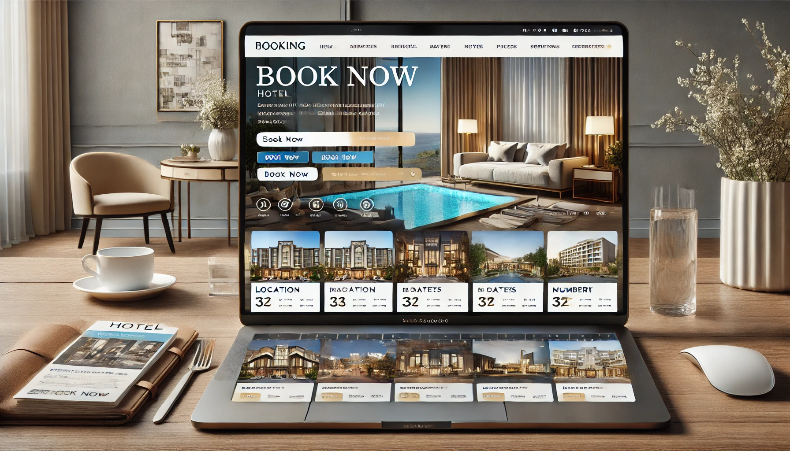

# The Stay Network


[](https://developer.mozilla.org/en-US/docs/Web/Guide/HTML/HTML5)


## Project Overview

Pestana CR7 is a comprehensive booking website designed to facilitate online reservations for hotels. The platform allows users to search, review, and book accommodations seamlessly. It serves as a bridge between hotel providers and customers, offering a user-friendly interface and robust backend services to handle transactions and user data securely. 





## Technologies Used

### Frontend:

**React.js**: Utilized for building the user interface with a component-based architecture, enhancing the reactivity and speed of the webpage.

**Redux**: Employed for state management across the React application, ensuring a consistent state with predictable behavior.

**CSS/SCSS**: Used for styling components with capabilities for variables, nesting, and more, making the stylesheets more maintainable.


### Backend:

**Node.js**: As the runtime environment to execute JavaScript on the server side.

**Express.js**: This framework simplifies routing and middleware implementation, making it easier to develop and maintain server-side logic.

**MongoDB**: Chosen for the database to store user and transaction data, benefitting from its flexibility and scalability.


### Authentication:

**JWT (JSON Web Tokens)**: Implemented for secure user authentication, ensuring that each request to the server is accompanied by a valid token that guarantees authorized access.
Development Tools:

**Git**: Used for version control, allowing multiple developers to work together efficiently.

**NPM**: Node package manager for managing dependencies.


## Features

### User Authentication:

**Secure login and registration functionality for users.**

**Implementation of JWT for session management, ensuring that users are authenticated before accessing or booking hotels.**


### Hotel Search and Booking:

**Users can search for hotels based on various criteria such as location, availability, and price range.**

**Each listing provides detailed information, including amenities, reviews, and photographs.**

**Booking functionality is integrated directly within the platform, allowing users to make reservations without leaving the site.**


### Interactive User Interface:

**Dynamic components like modals and dropdowns enhance user interaction.**

**Responsive design ensures that the website is accessible on various devices and screen sizes.**


### Admin Panel:

**Dashboard for hotel providers to manage their listings, view booking statistics, and update hotel information.**

**Real-time data visualization using charts and tables to track revenue and user engagement.**


## UI Components

**Nav**: This is used for all the different navbar components.

**Navbar**: The navbar component is used to add the logo, dropdown list, as well the links to the login/signup page and in future there will be other page links added here. 

**Form**: We have used the basic form component to make the login section in our project. 

**Alert**: This component is added in order to give an alert message for when a user submits the form or for other alerts such as incorrect email id or password, etc. 

**Modal**: It is used the same way to add a user notification or a custom content for the website. 

**Carousel**: This component is added for the different images of the hotels/places which the users can view before booking one. 

**Dropdown**: This component is added for the dropdown list of other links to different web pages. 

**Button**: Various buttons are added on the website for different functions. 

**Card**: It is added for good display and to customize the different sections of the website and make the design of the website attractive.

**Close button**: This component is added to dismiss the alerts of the modals. 

**Footer**: Footer component is also added in the website. 


## Available Scripts

In the project directory, you can run:

```
npm start
```

Runs the app in the development mode.\
Open [http://localhost:3000](http://localhost:3000) to view it in your browser.

The page will reload when you make changes.\
You may also see any lint errors in the console.


```
npm test
```

Launches the test runner in the interactive watch mode.\
See the section about [running tests](https://facebook.github.io/create-react-app/docs/running-tests) for more information.


```
npm run build
```

Builds the app for production to the `build` folder.\
It correctly bundles React in production mode and optimizes the build for the best performance.

The build is minified and the filenames include the hashes.\
Your app is ready to be deployed!

See the section about [deployment](https://facebook.github.io/create-react-app/docs/deployment) for more information.


## Conclusion

This booking website is a robust platform designed to streamline the process of finding and booking hotels. By leveraging modern web technologies and following best practices in web development, the project ensures a secure, efficient, and user-friendly experience. The scalability of the system allows for future expansions, such as including additional types of accommodations and implementing AI-driven features to personalize user experiences.